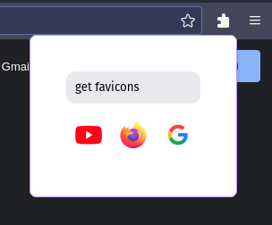

# Get Favicons



Download favicons from your tabs

## Dev
To run as dev, install [web-ext](https://extensionworkshop.com/documentation/develop/getting-started-with-web-ext/) and then run:
```
web-ext run
```

Or, open firefox and go to `about:debugging#/runtime/this-firefox`, click in `Load Temporary Add-on...` and select any file from this extension. 

## Build

To build by your own, download [web-ext](https://extensionworkshop.com/documentation/develop/getting-started-with-web-ext/), create and account at [mozilla addons](https://addons.mozilla.org), create an [api key](https://addons.mozilla.org/developers/addon/api/key/) and then run:


```
web-ext build
web-ext sign --api-key=your-api-key --api-secret=your-secret-key
```
